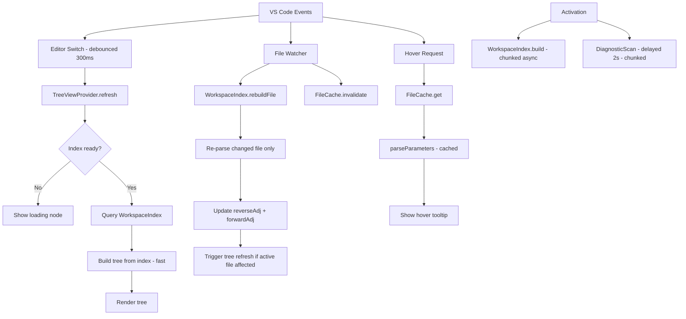

# Performance Improvements Plan

## Problem Summary

With 300+ YAML template files, the extension is slow in three main areas:
1. **Dependency tree ("Called by" section)** — almost always loading, takes many seconds
2. **Hover tooltip** — 5 seconds to show parameters for a template
3. **Opening a file from the tree view** — 3 seconds delay

---

## Root Cause Analysis

### Bottleneck 1 — `buildUpstreamTree()` in `treeViewProvider.js` (CRITICAL)

This is the single biggest performance problem. Every time the active editor changes, `getChildren()` is called synchronously on the main thread and calls `buildUpstreamTree()`, which does:

1. **`collectYamlFiles(workspaceRoot)`** — full recursive directory scan (300+ files)
2. For **every** YAML file found, reads it from disk (`fs.readFileSync`) to check if it calls the target
3. For **every** file that is a direct caller, calls **`findChain()`** recursively — which reads every file in the workspace again, recursively, to trace the full call chain

With 300 files, step 2 = 300 synchronous disk reads. Step 3 = for each of N callers, another full recursive traversal of the workspace. If a template is called by 8 files and each of those has 5 callers, that is potentially **thousands** of file reads** per tree refresh.

`findChain()` itself has no memoization — it re-reads every file from disk on every call, even files already read in the same refresh cycle.

**This runs synchronously on the extension host main thread**, blocking VS Code's UI.

### Bottleneck 2 — `buildDownstreamNodes()` in `treeViewProvider.js`

Also called synchronously in `getChildren()`. For each template reference it:
- Reads the resolved file from disk (`fs.readFileSync`)
- Calls `parseParameters()` on it
- Recursively does the same for all children

With deep dependency chains (5+ levels, 40 params each), this is many synchronous reads and parses.

### Bottleneck 3 — Hover provider (`hoverProvider.js`)

`provideHover()` calls `fs.readFileSync()` synchronously every time the user hovers over a `template:` line. With 40 parameters and complex YAML, `parseParameters()` runs on every hover with no caching. If the same template is hovered multiple times, the file is re-read and re-parsed every time.

### Bottleneck 4 — Diagnostic scan on startup

`scanWorkspace()` in `diagnosticProvider.js` runs immediately on activation and reads every YAML file sequentially. With 300 files, each of which may reference other templates (causing more reads via `validateCallSite` → `fs.readFileSync`), this is a very heavy startup operation that competes with the tree view for I/O.

### Bottleneck 5 — No caching anywhere

Every feature independently reads files from disk. There is **zero shared caching** between:
- `treeViewProvider` (reads files for upstream/downstream)
- `hoverProvider` (reads files for parameters)
- `diagnosticProvider` (reads files for validation)
- `graphDataBuilder` (reads files for graph)

The same file can be read 10+ times in a single user action.

### Bottleneck 6 — Tree refresh triggered by `setDiagnostics()`

In `extension.js`, `vscode.languages.onDidChangeDiagnostics` fires `treeProvider.setDiagnostics()` which fires `_onDidChangeTreeData`, which triggers a full `getChildren()` rebuild — including the expensive `buildUpstreamTree()`. Diagnostics can change frequently (on every keystroke after debounce), causing repeated full tree rebuilds.

---

## Proposed Improvements

### Improvement 1 — Shared In-Memory File Cache (HIGH IMPACT) ✅ IMPLEMENTED

**File:** New `fileCache.js` module

Create a singleton `FileCache` that:
- Stores `Map<absolutePath, { text: string, mtime: number }>`
- `get(filePath)`: returns cached text if mtime matches, otherwise reads from disk and caches
- `invalidate(filePath)`: removes a single entry (called by the file watcher)
- `invalidateAll()`: clears everything (called on workspace folder change)
- Integrates with the existing `FileSystemWatcher` in `diagnosticProvider.js`

**Impact:** Eliminates redundant disk reads. A file read once during a tree build is served from memory for hover, diagnostics, and graph — all within the same session.

```
// Rough API
class FileCache {
  get(filePath)          // → string | null
  invalidate(filePath)   // called by watcher
  invalidateAll()
  get size()
}
```

**Files modified:** `fileCache.js` (created), `graphDataBuilder.js`, `treeViewProvider.js`, `diagnosticProvider.js`

#### Benchmark Results — Improvement 1 (FileCache)

Fixture: 300 synthetic YAML files (120 leaves, 80 mids, 60 tops, 40 pipelines)

| Metric | Baseline | After FileCache | Change |
|--------|----------|-----------------|--------|
| `buildUpstreamTree` leaf [COLD] | 79.6 ms | 28.1 ms | **−65%** |
| `buildUpstreamTree` leaf [WARM] | 79.6 ms | 23.9 ms | **−70%** |
| `buildUpstreamTree` mid [COLD] | 78.3 ms | 28.7 ms | **−63%** |
| `parseParameters` × 300 [WARM] | 7.6 ms | 1.2 ms | **−84%** |
| `buildWorkspaceGraph` [COLD] | 15.3 ms | 15.3 ms | — |

---

### Improvement 2 — Pre-computed Reverse Adjacency Map (HIGH IMPACT) ✅ IMPLEMENTED

**File:** New `workspaceIndex.js` module

The core of the upstream-tree slowness is that `buildUpstreamTree()` re-scans the entire workspace on every tree refresh. Instead:

1. On activation (and after file changes), build a **workspace index** once:
   - `reverseAdj: Map<targetPath, Set<callerPath>>` — who calls whom
   - `forwardAdj: Map<callerPath, Set<targetPath>>` — what each file calls
   - `fileParams: Map<filePath, ParsedParam[]>` — cached parameter lists

2. The index is built **once** in the background using `setImmediate`/chunked processing so it doesn't block the UI.

3. When a file changes (watcher fires), only that file's entries are re-computed (partial invalidation).

4. `buildUpstreamTree()` and `buildDownstreamNodes()` query the index instead of scanning disk.

**Impact:** Upstream tree goes from O(N²) disk reads to O(1) map lookups after the initial index build. With 300 files, this is the difference between ~3 seconds and ~10ms.

```
// Rough API
class WorkspaceIndex {
  async build(workspaceRoot)          // initial full scan (chunked, async)
  async rebuildFile(filePath)         // partial update on file change
  getCallers(filePath)                // → Set<string>
  getCallees(filePath)                // → Set<string>
  getParams(filePath)                 // → ParsedParam[]
  isReady()                           // → boolean
  onReady(callback)                   // fires when initial build completes
}
```

**Files modified:** `workspaceIndex.js` (created), `treeViewProvider.js`, `extension.js`

#### Benchmark Results — Improvement 2 (WorkspaceIndex)

Fixture: 300 synthetic YAML files (120 leaves, 80 mids, 60 tops, 40 pipelines)

| Metric | Baseline | After FileCache | After WorkspaceIndex | Total Change |
|--------|----------|-----------------|----------------------|--------------|
| `buildUpstreamTree` leaf [COLD] | 79.6 ms | 28.1 ms | **0.8 ms** | **−99.0%** |
| `buildUpstreamTree` leaf [WARM] | 79.6 ms | 23.9 ms | **0.2 ms** | **−99.7%** |
| `buildUpstreamTree` mid [COLD] | 78.3 ms | 28.7 ms | **0.1 ms** | **−99.9%** |
| `parseParameters` × 300 [WARM] | 7.6 ms | 1.2 ms | **1.2 ms** | **−84%** |

The O(N²) `findChain()` recursive disk-scan traversal was replaced with a BFS over the in-memory `reverseAdj` map. With 300 files, upstream tree lookup dropped from ~80 ms to sub-millisecond.

---

### Improvement 3 — Async Tree Building with Loading State (HIGH IMPACT)

**File:** `treeViewProvider.js`

`getChildren()` must return synchronously per the VS Code API, but the heavy work can be moved to an async pre-computation step:

1. When `refresh(filePath)` is called, immediately fire `_onDidChangeTreeData` with a **loading placeholder** node.
2. In the background (async), compute `buildUpstreamTree()` and `buildDownstreamNodes()` using the workspace index.
3. When done, store the result and fire `_onDidChangeTreeData` again to show the real tree.

This means the tree view is never "frozen" — it shows a spinner/loading state immediately, then populates when ready.

```
// In getChildren(node):
if (!node) {
  if (this._isBuilding) {
    return [new DepNode({ kind: 'loading', label: 'Loading dependencies…' })];
  }
  return this._cachedRootNodes;
}
```

---

### Improvement 4 — Debounced Tree Refresh on Editor Switch (MEDIUM IMPACT)

**File:** `treeViewProvider.js`

Currently `updateForEditor()` fires immediately on every `onDidChangeActiveTextEditor` event. When a user quickly switches between files (e.g. using Ctrl+Tab), this triggers multiple full tree rebuilds.

Add a **300ms debounce** to `updateForEditor()` so only the final file in a rapid switch sequence triggers a rebuild.

```javascript
let _editorSwitchTimer = null;
function updateForEditor(editor) {
  if (_editorSwitchTimer) clearTimeout(_editorSwitchTimer);
  _editorSwitchTimer = setTimeout(() => {
    // existing logic
  }, 300);
}
```

---

### Improvement 5 — Lazy Upstream Tree (MEDIUM IMPACT)

**File:** `treeViewProvider.js`

The "Called by" section currently builds the **full transitive upstream tree** eagerly — even if the user never expands it. For a template called by 8 files, each with 5 callers, this is a deep recursive traversal.

Change the approach:
- Show only **direct callers** initially (collapsed)
- Load each caller's own callers **lazily** when the user expands that node
- Use the workspace index for O(1) lookups

This means the initial tree render is fast (just direct callers), and deeper levels load on demand.

---

### Improvement 6 — File Content Cache in Hover Provider (MEDIUM IMPACT)

**File:** `hoverProvider.js`

`provideHover()` calls `fs.readFileSync()` synchronously on every hover. Add a simple **LRU cache** (max 50 entries, 30-second TTL) for parsed parameter results:

```javascript
// Cache: filePath → { params, mtime, cachedAt }
const _paramCache = new Map();

function getCachedParams(filePath) {
  const entry = _paramCache.get(filePath);
  if (entry && Date.now() - entry.cachedAt < 30000) return entry.params;
  // re-read and re-parse
  const text = fs.readFileSync(filePath, 'utf8');
  const params = parseParameters(text);
  _paramCache.set(filePath, { params, cachedAt: Date.now() });
  return params;
}
```

**Impact:** Hovering over the same template multiple times (very common) becomes instant after the first hover.

---

### Improvement 7 — Diagnostic Scan Throttling (MEDIUM IMPACT)

**File:** `diagnosticProvider.js`

The initial `runFullScan()` runs immediately on activation and reads all 300 files. This competes with the tree view's initial build for I/O bandwidth.

Changes:
1. **Delay the initial scan** by 2 seconds after activation to let the tree view build first
2. **Process files in chunks** (e.g. 20 files per `setImmediate` tick) to avoid blocking the event loop
3. **Skip files that haven't changed** using mtime comparison (via the shared file cache)

```javascript
// Chunked scan
async function scanWorkspaceChunked(collection, uris) {
  const CHUNK = 20;
  for (let i = 0; i < uris.length; i += CHUNK) {
    const chunk = uris.slice(i, i + CHUNK);
    for (const uri of chunk) { /* process */ }
    await new Promise(r => setImmediate(r)); // yield to event loop
  }
}
```

---

### Improvement 8 — Separate Diagnostics Refresh from Tree Refresh (LOW IMPACT)

**File:** `extension.js`, `treeViewProvider.js`

Currently `setDiagnostics()` fires `_onDidChangeTreeData(undefined)` which triggers a **full tree rebuild** (including `buildUpstreamTree()`). But diagnostics only affect node icons/colors — the tree structure doesn't change.

Fix: fire `_onDidChangeTreeData(undefined)` only when the active file changes. When only diagnostics change, update node decorations without rebuilding the tree structure.

This requires storing the built tree nodes and only re-calling `getTreeItem()` (not `getChildren()`) when diagnostics change. VS Code supports this via `_onDidChangeTreeData.fire(specificNode)` instead of `fire(undefined)`.

---

## Implementation Order (by impact/effort ratio)

| # | Improvement | Impact | Effort | Priority |
|---|-------------|--------|--------|----------|
| 1 | Shared file cache (`fileCache.js`) | High | Low | **1st** |
| 2 | Workspace index with reverse adj map (`workspaceIndex.js`) | Very High | Medium | **2nd** |
| 3 | Async tree building + loading state | High | Medium | **3rd** |
| 4 | Debounced editor switch | Medium | Low | **4th** |
| 5 | Lazy upstream tree expansion | Medium | Medium | **5th** |
| 6 | Hover param cache | Medium | Low | **6th** |
| 7 | Diagnostic scan throttling + chunking | Medium | Low | **7th** |
| 8 | Decouple diagnostics from tree rebuild | Low | Medium | **8th** |

---

## Architecture Diagram



---

## Files to Create / Modify

| File | Action | Description |
|------|--------|-------------|
| `fileCache.js` | **Create** | Shared mtime-aware file content cache |
| `workspaceIndex.js` | **Create** | Pre-computed reverse/forward adjacency + param cache |
| `treeViewProvider.js` | **Modify** | Use index, async build, debounce, lazy upstream, loading state |
| `hoverProvider.js` | **Modify** | Use fileCache for reads, cache parsed params |
| `diagnosticProvider.js` | **Modify** | Delay startup scan, chunked processing, use fileCache |
| `graphDataBuilder.js` | **Modify** | Use fileCache for reads |
| `extension.js` | **Modify** | Wire up WorkspaceIndex lifecycle, decouple diag/tree refresh |
